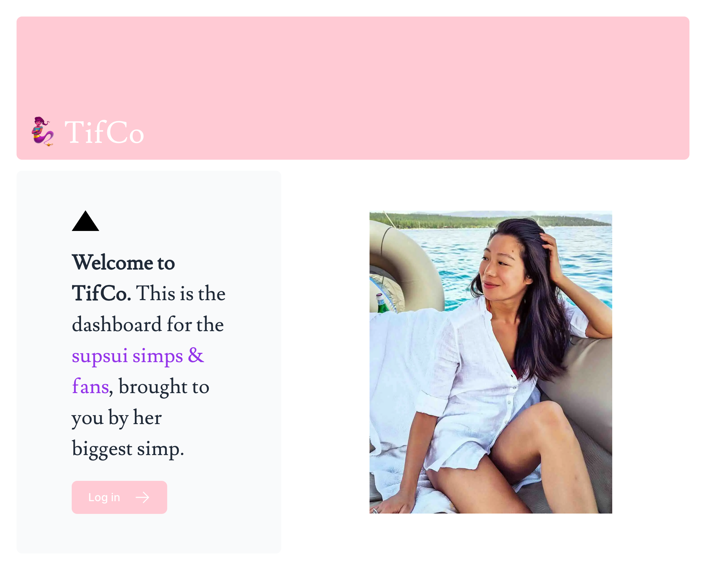
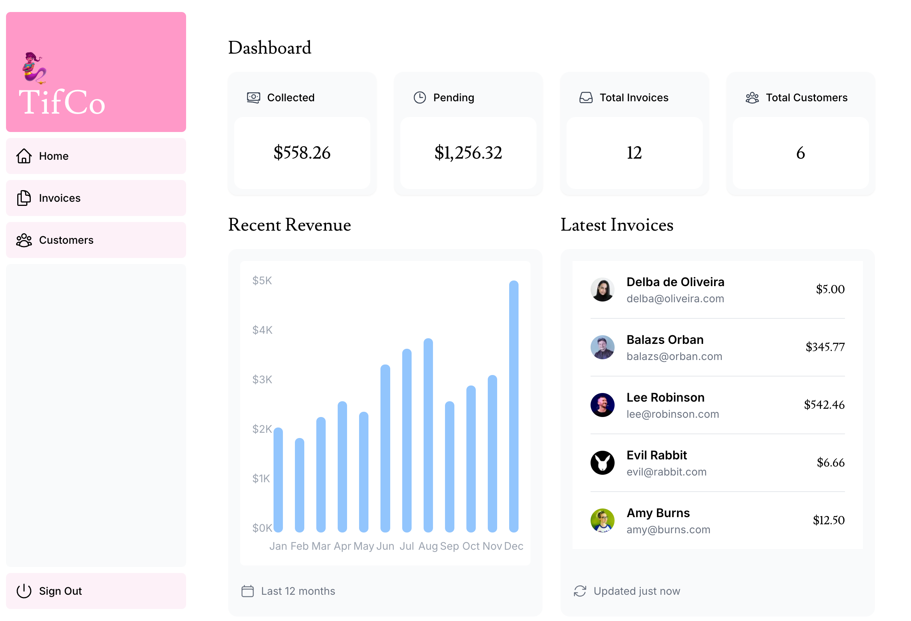
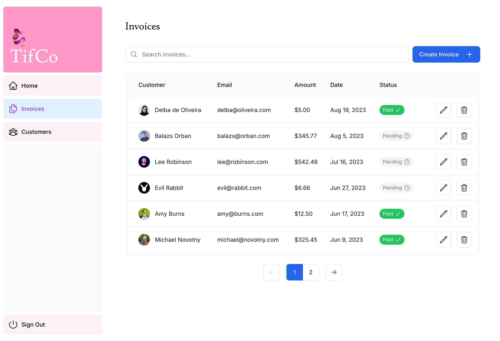
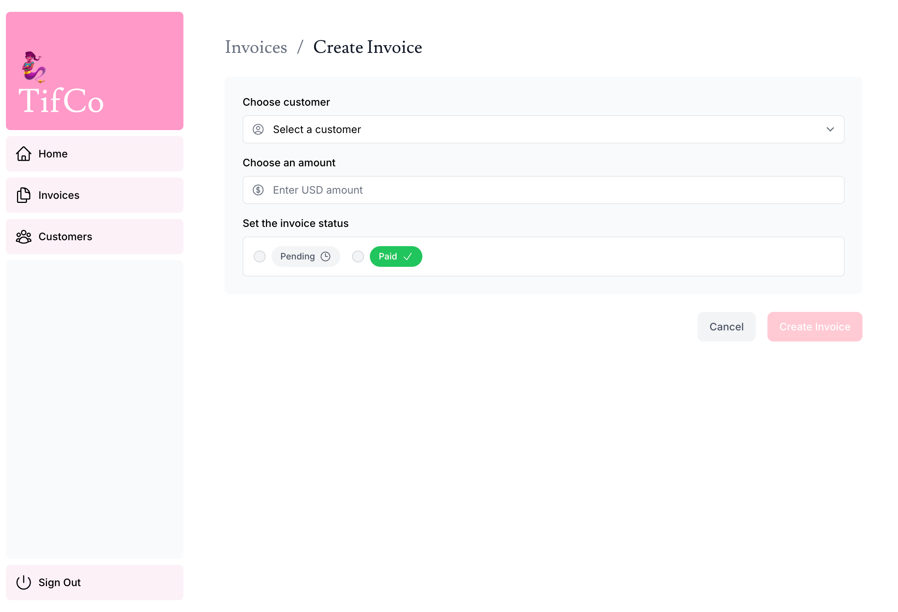
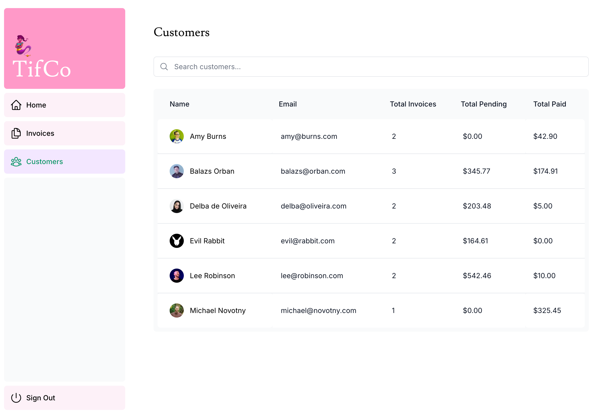

# 🧞‍♀️ TifCo Dashboard

This is a dashboard project I built to learn more about NextJS, Tailwind, React, Vercel, and a few other tools. It's pretty basic but fun to put together.

Its a react frontend with next and tailwind for styling. Deployed on Vercel and using their postgres for storage. It has auth, is fully responsive, and is a great base for me to add more interesting features.

---

## Status

- [x] Setup
- [x] Styling (Tailwind)
- [x] Font & Image optimization
- [x] layouts & pages
- [x] navigation & pagination
- [x] deployment & db setup
- [x] fetching data
- [x] static/dynamic rendering
- [x] streaming
- [x] ppr
- [x] search & more pagination
- [x] data mutation
- [x] error handling
- [x] accessibility
- [x] auth
- [x] metadata
- [x] MVP Complete
- [ ] Customer portal
- [ ] user profile & preferences
- [ ] seo
- [ ] custom reporting
- [ ] rbac
- [ ] dashboard builder (drag & drop)
- [ ] custom queries

---

## Screenshots

Landing Page

Login Page

Dashboard Page/Home

Invoices Page

Create/Edit Invoice Page

Customers Page

---

## Installation & Setup

###### 
(In terminal) Navigate to the folder you intend to install the app in and clone the repo.
######
    git clone https://github.com/Nostromos/TifCo.git

Install dependencies.
######
    pnpm install

Run the dev build OR
######
    pnpm dev

Get a production build and run it locally.
######
    pnpm build && pnpm start

---

## Codebase Overview

- `~` - Contains config files for the project and some auth logic.
- `app` - This is where the majority of the app code will live. Mostly equivalent to `src`. This is also the router next uses, built on react server components. Your layout and folder names determine routing, loading states, error handling, and other stuff.
  - `dashboard` - the main page for the app where your dashboard lives - all other pages (landing & login excepted) live beneath this. 
    - `(overview)` - enclosed in brackets to denote a group route for `/dashboard` that contains the main dashboard page.
    - `customers` - the customers table page
    - `invoices` - the page for invoices, containing routes for creating and editing invoices.
  - `lib` - Files containing utility functions, type definitions, test data, and other utls. `actions.ts` is where you'll find most of the query logic. 
  - `login` - Page logic for the login page.
  - `seed` - Route to seed the db with initial placeholder data.
  - `ui` - Contains components, styling, fonts, and primitives.
    - `customers` - Customer table component
    - `dashboard` - Dashboard components including nav-links for the sidebar.
    - `invoices` - Components for displaying the invoice table and forms for creating & editing individual invoices. The visual pagination component lives here.
- `public` - This is where static assets live to served (mostly images). Static metadata files are kept inside the `app` folder.
- `readme` - Screenshots for the readme live here.

---

## Reflection

> What was the context for this project? 

This is a portfolio project to help me find a job. There was a lot of personal interest in learning Next, exploring Vercel's offering, improving my typescript knowledge, and deepening react learnings.

> What did you set out to build?

I set out to build a *very* basic dashboard project, per the next tutorial, but wanted to add more features and pages on my own.

> Why was this project challenging and therefore a really good learning experience?

Its the first time I've done a project entirely in typescript. The pre-built UI made it much faster. NextJS is easy enough to get started with but has surprising depth. Very interest framework.

> What were some unexpected obstacles?

While they provide a lot of template code, I believe they intentionally don't implement all of the features they set up. Getting the Customers page set up, writing my own types, and starting to work with server actions weren't clear at start but turned out to be pretty easy after I did a bit of reasoning. 

> What tools did you use to implement this project?

Typescript, [NextJS](https://nextjs.org), [React](https://react.dev), [Vercel](https://vercel.com/), [@vercel/postgres](https://vercel.com/docs/storage/vercel-postgres), [Zod](https://zod.dev/), [@next-auth](https://next-auth.js.org/), [pnpm](https://pnpm.io/), [clsx](https://www.npmjs.com/package/clsx), and [Tailwind](https://tailwindcss.com/). [Heroicons](https://heroicons.com/) is an *excellent* resource to quickly get and use icons. 